# Lab 2
### ερωτημα 1

#### **401.bzip**

cache_line_size=64                                                                                      

**Time:**                                                                                                         
sim_seconds                              	0.083982                   	# Number of seconds simulated                              
host_seconds                              	1309.57                   	# Real time elapsed on the host

**CPI:**                                                                                               
system.cpu.cpi                           	1.679650                   	# CPI: cycles per instruction

**L2:**                                                                                                          
system.l2.tags.occ_percent::.cpu.inst    	0.002547                   	# Average percentage of cache occupancy          
system.l2.tags.occ_percent::.cpu.data    	0.969911                   	# Average percentage of cache occupancy           
system.l2.tags.occ_percent::total        	0.973719                   	# Average percentage of cache occupancy                     

**L1/i:**                                                                                                                    
system.cpu.icache.tags.occ_percent::total     0.705044                      # Average percentage of cache occupancy

**L1/d:**
system.cpu.dcache.tags.occ_percent::total 	0.984600                   	# Average percentage of cache occupancy

**L1/i/miss**
system.cpu.icache.overall_miss_rate::total 	0.000077                   	# miss rate for overall accesses

**L1/d/miss**
system.cpu.dcache.overall_miss_rate::total 	0.014798                   	# miss rate for overall accesses

**L2/miss**
system.l2.overall_miss_rate::total       	0.282163                   	# miss rate for overall accesses

------------------------------------------------------------------------------------------------------

#### **429hmmer**
**Time:**
sim_seconds                              	0.064955                   	# Number of seconds simulated
host_seconds                              	1618.30                   	# Real time elapsed on the host

**CPI:**
system.cpu.cpi                           	1.299095                   	# CPI: cycles per instruction

cache_line_size=64

**L2:**
system.l2.tags.occ_percent::.cpu.inst    	0.009525                   	# Average percentage of cache occupancy
system.l2.tags.occ_percent::.cpu.data    	0.784390                   	# Average percentage of cache occupancy
system.l2.tags.occ_percent::total        	0.793954                   	# Average percentage of cache occupancy

**L1/i:**
system.cpu.icache.tags.occ_percent::total 	0.776715                   	# Average percentage of cache occupancy

**L1/d:**
system.cpu.dcache.tags.occ_percent::total 	0.996534                   	# Average percentage of cache occupancy

**L1/i/miss:**
system.cpu.icache.overall_miss_rate::total 	0.023612                   	# miss rate for overall accesses

**L1/d/miss:**
system.cpu.dcache.overall_miss_rate::total 	0.002108                   	# miss rate for overall accesses

**L2/miss:**
system.l2.overall_miss_rate::total       	0.055046                   	# miss rate for overall accesses

--------------------------------------------------------------------------------------------------------

#### **456.hmmer**

cache_line_size=64

**Time:**                                                                                                                      
sim_seconds                              	0.059396                   	# Number of seconds simulated                                   
host_seconds                              	1606.29                   	# Real time elapsed on the host                                  

**CPI:**                                                                                                           
system.cpu.cpi                           	1.187917                   	# CPI: cycles per instruction                   

**L2:**                                                                                                               
system.l2.tags.occ_percent::.cpu.inst    	0.039329                   	# Average percentage of cache occupancy
system.l2.tags.occ_percent::.cpu.data    	0.121653                   	# Average percentage of                     
 
**cache occupancy**                                                                                                     
system.l2.tags.occ_percent::total        	0.160981                   	# Average percentage of cache occupancy

**L1/i:**                                                                                                           
system.cpu.icache.tags.occ_percent::total 	0.991227                   	# Average percentage of cache occupancy                  

**L1/d:**                                                                                                       
system.cpu.dcache.tags.occ_percent::total 	0.990023                   	# Average percentage of cache occupancy                  

**L1/i/miss:**                                                                                                  
system.cpu.icache.overall_miss_rate::total 	0.000221                   	# miss rate for overall accesses              

**L1/d/miss:**                                                                                                
system.cpu.dcache.overall_miss_rate::total 	0.001637                   	# miss rate for overall accesses                        

**L2/miss:**                                                                                                            
system.l2.overall_miss_rate::total       	0.077760                   	# miss rate for overall accesses                       

-------------------------------------------------------------------------
 #### **458.sjeng**

cache_line_size=64                                                               

**Time:**                                                                                                                      
host_seconds                              	3116.30                   	# Real time elapsed on the host                          
sim_seconds                              	0.513528                   	# Number of seconds simulated                           

**CPI:**                                                                                                                   
system.cpu.cpi                          	10.270554                   	# CPI: cycles per instruction                                        

**L2:**                     
system.l2.tags.occ_percent::.cpu.inst    	0.000156                   	# Average percentage of cache occupancy    
system.l2.tags.occ_percent::.cpu.data    	0.992025                   	# Average percentage of cache occupancy     
system.l2.tags.occ_percent::total        	0.992198                   	# Average percentage of cache occupancy     

**L1/i:**                                                                                                       
system.cpu.icache.tags.occ_percent::total 	0.751317                   	# Average percentage of cache occupancy    

**L1/d:**                                                                                                             
system.cpu.dcache.tags.occ_percent::total 	0.999594                   	# Average percentage of cache occupancy                  

**L1/i/miss:**                                                                                                           
system.cpu.icache.overall_miss_rate::total 	0.000020                   	# miss rate for overall accesses                               

**L1/d/miss:**                                                                                                                 
system.cpu.dcache.overall_miss_rate::total 	0.121831                   	# miss rate for overall accesses                                

**L2/miss:**                                                                                                            
system.l2.overall_miss_rate::total       	0.999972                   	# miss rate for overall accesses                   

-------------------------------------------------------------------------------------------------------------

#### **470.lbm**

cache_line_size=64                                                                                             

**Time:**                                                                                                      
host_seconds                              	1593.61                   	# Real time elapsed on the host                     
sim_seconds                              	0.174671                   	# Number of seconds simulated                                

**CPI:**                                                                                                                           
system.cpu.cpi                           	3.493415                   	# CPI: cycles per instruction

**L2:**                                                                                                                         
system.l2.tags.occ_percent::.cpu.inst    	0.000293                   	# Average percentage of cache occupancy                 
system.l2.tags.occ_percent::.cpu.data    	0.989336                   	# Average percentage of cache occupancy           
system.l2.tags.occ_percent::total        	0.989629                   	# Average percentage of cache occupancy              

**L1/i:**                                                                                                               
system.cpu.icache.tags.occ_percent::total 	0.681547                   	# Average percentage of cache occupancy     

**L1/d:**                                                                                                         
system.cpu.dcache.tags.occ_percent::total 	0.999455                   	# Average percentage of cache occupancy          

**L1/i/miss:**                                                                                                  
system.cpu.icache.overall_miss_rate::total 	0.000094                   	# miss rate for overall accesses            

**L1/d/miss:**                                                                                                  
system.cpu.dcache.overall_miss_rate::total 	0.060972                   	# miss rate for overall accesses          

**L2/miss:**                                                                                                           
system.l2.overall_miss_rate::total       	0.999944                   	# miss rate for overall accesses                   

##### Τα γραφήματα που απεικονίζουν τις παραπάνω πληροφορίες για το σύνολο των benchmarks:

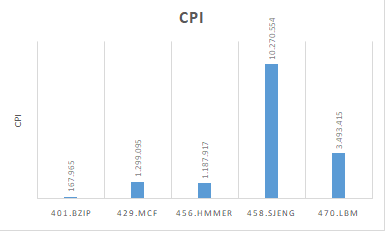
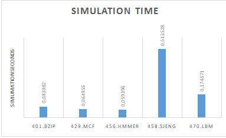
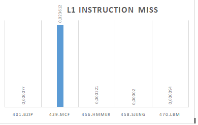
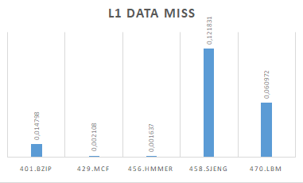
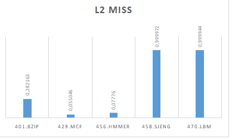

Αυτό που παρατηρήσαμε είναι οτι όσο καλύτερο cpi έχει ενα benchmark τοσο καλύτερο simulation time παρουσιαζεί και τόσα λιγότερα miss εμφανίζει.Συνεπώς στην περίπτωση αυτή έχουμε λιγότερο χρόνο και λιγότερα errors.Επίσής απο τα γραφήματα παρατηρούμε οτι η τιμή των l1_dcache_miss και των l2_cache_miss εμφανίζει αρκέτα όμοια συμπεριφόρα σε αντίθεση με την τιμή των l1_icache_miss που δεν δείχνει σημαντική εξάρτηση απο το cpi ούτε απο κάποια άλλη παράμετρο.

------------------------------------------------------------------------------------------------------------------------------

Επείτα μας ζητήθηκε να εκτελέσουμε ξάνα τα benchmarks με μία επιπλέον παράμετρο,την **--cpu-clock=2GHz** αλλά δεν παράτηρήσαμε κάμια διαφορά στην παραμέτρους που αφορούν το ρολόι.

    

2GHz                                                                                                                                
system.clk_domain.clock                      	1000                   	# Clock period in ticks                          
system.cpu_clk_domain.clock                   	500                   	# Clock period in ticks                              

default                                                                                       
system.clk_domain.clock                      	1000                   	# Clock period in               
system.cpu_clk_domain.clock                   	500                   	# Clock period in ticks                

### ερωτημα 2
Οι τίμές που επιλέξαμε να δώσουμε στις παραμέτρους των benchmarks ώστε να προκύψουν αντίστοιχοι συνδιασμοί είναι:              

cacheline_size=16                                                                                   
cacheline_size=64                                                                                               
l1_data_assoc=1                                                                   
l1_data_assoc=2                                                                   
l1_data_assoc=8                                                                     
l1_data_size=128kB                                                                                           
l1_data_size=32kB                                                            
l1_instruction_assoc=1                                                                                                     
l1_instruction_assoc=2                                                                   
l1_instruction_assoc=8               
l1_instruction_size=32kB                                                          
l2_assoc=1                                              
l2_assoc=2                                               
l2_assoc=8                                
l2_size=2MB                                                   
l2_size=4MB                                                    
l2_size=512kB                              

##### Tα αποτελέσματα που προέκυψαν για το 401.bzip:                                   
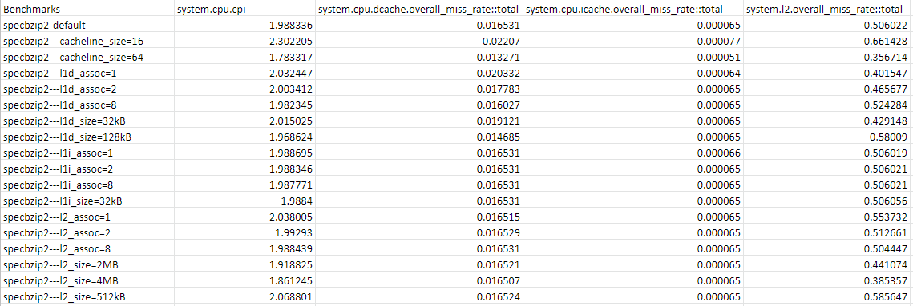                                                     

##### Tα αποτελέσματα που προέκυψαν για το 470.lbm:                            
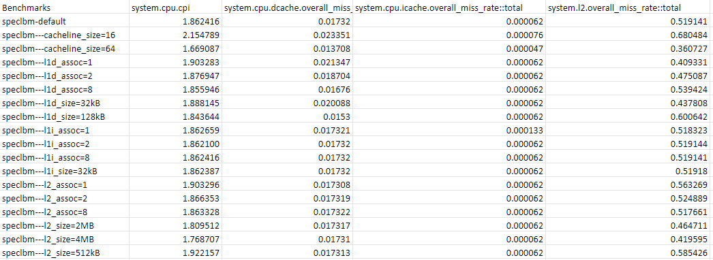                                    

##### Tα αποτελέσματα που προέκυψαν για το 458.sjeng:
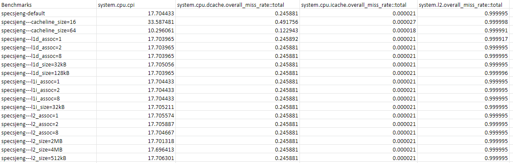           

##### Τα γραφήματα που παρασουσιάζουν την επίδραση κάθε παράγοντα στην απόδοση κάθε benchmark είναι τα εξης:
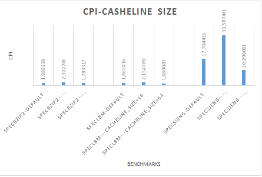            
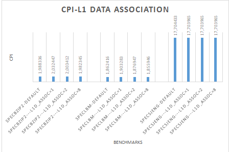                
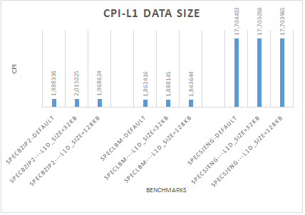                            
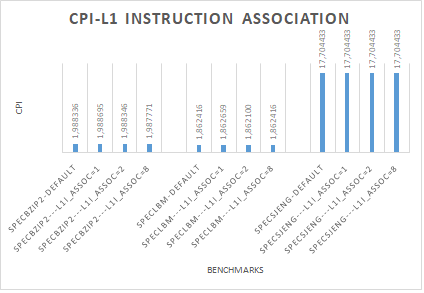                
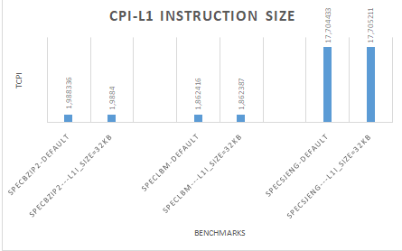
                
   
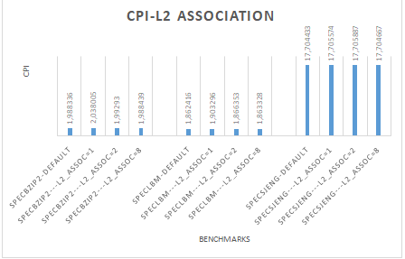                
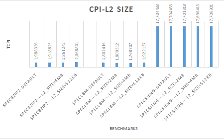  

Παρατηρούμε οτι ο παράγοντας με την μεγαλύτερη επίδραση είναι ξεκάθαρα το μέγεθος του cacheline,η αύξηση του βελτιώνει την τιμή του cpi
αισθητά, την κάνει δηλαδή να τείνει προς το 1 (άριστο).Επίσης η αύξηση του cacheline_size ελαχιστοποιεί τα errors του συστήματος καθώς μειώνονται οι τιμές των misses συνολικά και στα δύο είδη  μνήμων (l2 και l1_instruction-l1_data). Όσο αφορα την επίδραση του associativity παρατηρούμε οτι η αλλαγή της τιμής του στο l1_instruction δεν προκαλεί καμία διαφορά στα misses και η επιρροή του στην τιμή του cpi υπάρχει αλλά είναι αρκετά ασήμαντη.Σε αντίθεση όταν αυξάνουμε τις τιμές των l1_data_assoc και l2_assoc παρατηρούμε οτι το cpi αυξάνεται σε εναν σημαντικό βαθμό.Η αυξηση(μείωση) του l1_data_assoc μειώνει(αυξάνει) τα l1_data_miss και αυξάνει(μειώνει) τα l2_miss ενω η αύξηση(μείωση) του l2_assoc μειώνει(αυξάνει) τα l2_miss και αυξάνει(μειώνει) τα l1_data αντίστοιχα.Η τιμή τιμή των l1_instruction_miss δεν επηρεάζεται καθόλου απο την αλλαγή του associativity.Σχετικά με το μέγεθος της μνήμης,βλέπουμε οτι η μείωση του l1_instruction_size χειροτερεύει το cpi  και δεν επηρρεάζει καθόλου τα l1_instruction_miss,l1_data_miss  ενω η επιδρασή του στο l2_miss είναι σχεδόν μηδενική.Όπως και στο associativity  ετσι και στο size παρατηρούμε στην περίπτωση του l1_data η αύξηση(μείωση) του προκάλει
 μείωση(αύξηση) στα l1_data_miss και αυξήση(μέιωση) στα l2_miss. Η αύξηση του l2_size όμως προκαλεί μείωση και στα l1_data_miss και l2_miss.

----------------------------------------------------------------------------------------------------------------------------------------

### ερωτημα 3

Από τα αποτελέσματα των εκτελέσεων των benchmarks στο ερώτημα 2 για διάφορους συνδιασμούς τιμών σε βασικές παραμέτρους καταλήγουμε στο συμπέρασμα ότι η παράμετρος στην οποία αξίζει περισσότερο να επενδύσουμε ανεξάρτητα απο το κόστος της είναι το cacheline_size καθώς με την αύξηση της βελτιωνεί σημαντικά το cpi και τα misses του συστήματος,άρα αυξάνει την αποδοτικότητα του. Σχετικά με την l1 cache μνήμη παρατηρούμε οτι το σύστημα επηρρεάζεται περισσότερο απο το l1_data αρα θα προτιμούσαμε το πληθος αυτών να υπερτερεί έναντι του πλήθος των l1_instruction.H επίδραση όμως της l2_cache παρατηρήσαμε ότι είναι πιο ουσιαστική απο αυτή της l1_cache και γνωρίζοντας οτι η l2 κοστίζει λιγότερο κρίνουμε χρήσιμο να επενδύσουμε σε αυτήν την μνήμη περισσότερο. Το associativity των l2_cache  και l1_data_cache φάνηκε ότι ασκεί επιρροή στο cpi και τα misses αλλά η αύξηση του αυξάνει την πολυπλοκότητα του συστήματος όποτε καλό είναι να βρίσκεται σε μεσαία επιπεδα.Eπίσης,τα l2_size,l1_data_size με την αύξηση τους βελτιώνουν το συστήμα(το l2_size λίγο περισσότερο)
Συμπερασματικά, θα επιλέγαμε ενα μεγάλο cacheline_size,περισσότερες μνήμες τυπου l2 ,πλήθος l1_data μεγαλύτερο το l1_instraction και associativity των l1_data kai l2 σε μέσο επίπεδο ενώ του l1_instruction χαμηλό.Επιπλέον σε μεσαίο επίπεδο θα πρέπει να κρατηθουν και τα l2_size Και l1_data_size.

