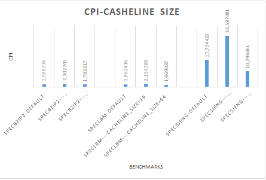

# Vasia-Tsachila

# Lab 2
### ερωτημα 1

#### **401.bzip**
**Time:**
sim_seconds                              	0.083982                   	# Number of seconds simulated

host_seconds                              	1309.57                   	# Real time elapsed on the host
**CPI:**
system.cpu.cpi                           	1.679650                   	# CPI: cycles per instruction

**L2:**
system.l2.tags.occ_percent::.cpu.inst    	0.002547                   	# Average percentage of cache occupancy
system.l2.tags.occ_percent::.cpu.data    	0.969911                   	# Average percentage of cache occupancy
system.l2.tags.occ_percent::total        	0.973719                   	# Average percentage of cache occupancy

**L1/i:**
system.cpu.icache.tags.occ_percent::total     0.705044                       # Average percentage of cache occupancy

**L1/d:**
system.cpu.dcache.tags.occ_percent::total 	0.984600                   	# Average percentage of cache occupancy

cache_line_size=64

**L1/i/miss**
system.cpu.icache.overall_miss_rate::total 	0.000077                   	# miss rate for overall accesses

**L1/d/miss**
system.cpu.dcache.overall_miss_rate::total 	0.014798                   	# miss rate for overall accesses

**L2/miss**
system.l2.overall_miss_rate::total       	0.282163                   	# miss rate for overall accesses

Q3: 

system.clk_domain.clock                 =     1000   παντού 
system.cpu_clk_domain.clock          =     500    παντού 

1GHz
system.clk_domain.clock                      	1000                   	# Clock period in ticks
system.cpu_clk_domain.clock                   	500                   	# Clock period in ticks

2GHz
system.clk_domain.clock                      	1000                   	# Clock period in 
system.cpu_clk_domain.clock                   	500                   	# Clock period in ticks

------------------------------------------------------------------------------------------------------

#### **429hmmer**
**Time:**
sim_seconds                              	0.064955                   	# Number of seconds simulated
host_seconds                              	1618.30                   	# Real time elapsed on the host

**CPI:**
system.cpu.cpi                           	1.299095                   	# CPI: cycles per instruction

cache_line_size=64

**L2:**
system.l2.tags.occ_percent::.cpu.inst    	0.009525                   	# Average percentage of cache occupancy
system.l2.tags.occ_percent::.cpu.data    	0.784390                   	# Average percentage of cache occupancy
system.l2.tags.occ_percent::total        	0.793954                   	# Average percentage of cache occupancy

**L1/i:**
system.cpu.icache.tags.occ_percent::total 	0.776715                   	# Average percentage of cache occupancy

**L1/d:**
system.cpu.dcache.tags.occ_percent::total 	0.996534                   	# Average percentage of cache occupancy

**L1/i/miss:**
system.cpu.icache.overall_miss_rate::total 	0.023612                   	# miss rate for overall accesses

**L1/d/miss:**
system.cpu.dcache.overall_miss_rate::total 	0.002108                   	# miss rate for overall accesses

**L2/miss:**
system.l2.overall_miss_rate::total       	0.055046                   	# miss rate for overall accesses

--------------------------------------------------------------------------------------------------------

### **456.hmmer**

cache_line_size=64

**Time:**
sim_seconds                              	0.059396                   	# Number of seconds simulated
host_seconds                              	1606.29                   	# Real time elapsed on the host

**CPI:**
system.cpu.cpi                           	1.187917                   	# CPI: cycles per instruction

**L2:**
system.l2.tags.occ_percent::.cpu.inst    	0.039329                   	# Average percentage of cache occupancy
system.l2.tags.occ_percent::.cpu.data    	0.121653                   	# Average percentage of 

**cache occupancy**
system.l2.tags.occ_percent::total        	0.160981                   	# Average percentage of cache occupancy

**L1/i:**
system.cpu.icache.tags.occ_percent::total 	0.991227                   	# Average percentage of cache occupancy

**L1/d:**
system.cpu.dcache.tags.occ_percent::total 	0.990023                   	# Average percentage of cache occupancy

**L1/i/miss:**
system.cpu.icache.overall_miss_rate::total 	0.000221                   	# miss rate for overall accesses

**L1/d/miss:**
system.cpu.dcache.overall_miss_rate::total 	0.001637                   	# miss rate for overall accesses

**L2/miss:**
system.l2.overall_miss_rate::total       	0.077760                   	# miss rate for overall accesses

-------------------------------------------------------------------------
 ##**458.sjeng**

cache_line_size=64
**Time:**
host_seconds                              	3116.30                   	# Real time elapsed on the host
sim_seconds                              	0.513528                   	# Number of **seconds simulated
**
**CPI:**
system.cpu.cpi                          	10.270554                   	# CPI: **cycles per instruction

****L2:**
system.l2.tags.occ_percent::.cpu.inst    	0.000156                   	# Average percentage of cache occupancy
system.l2.tags.occ_percent::.cpu.data    	0.992025                   	# Average percentage of cache occupancy
system.l2.tags.occ_percent::total        	0.992198                   	# Average percentage of cache occupancy

**L1/i:**
system.cpu.icache.tags.occ_percent::total 	0.751317                   	# Average percentage of cache occupancy

**L1/d:**
system.cpu.dcache.tags.occ_percent::total 	0.999594                   	# Average percentage of cache occupancy

**L1/i/miss:**
system.cpu.icache.overall_miss_rate::total 	0.000020                   	# miss rate for overall accesses

**L1/d/miss:**
system.cpu.dcache.overall_miss_rate::total 	0.121831                   	# miss rate for overall accesses

**L2/miss:**
system.l2.overall_miss_rate::total       	0.999972                   	# miss rate for overall accesses

-------------------------------------------------------------------------------------------------------------

#### **470.lbm**
**
cache_line_size=64

**Time:**
host_seconds                              	1593.61                   	# Real time elapsed on the host
sim_seconds                              	0.174671                   	# Number of seconds simulated

**CPI:**
system.cpu.cpi                           	3.493415                   	# CPI: cycles per instruction

**L2:**
system.l2.tags.occ_percent::.cpu.inst    	0.000293                   	# Average percentage of cache occupancy
system.l2.tags.occ_percent::.cpu.data    	0.989336                   	# Average percentage of cache occupancy
system.l2.tags.occ_percent::total        	0.989629                   	# Average percentage of cache occupancy

**L1/i:**
system.cpu.icache.tags.occ_percent::total 	0.681547                   	# Average percentage of cache occupancy
**L1/d:**
system.cpu.dcache.tags.occ_percent::total 	0.999455                   	# Average percentage of cache occupancy

**L1/i/miss:**
system.cpu.icache.overall_miss_rate::total 	0.000094                   	# miss rate for overall accesses

**L1/d/miss:**
system.cpu.dcache.overall_miss_rate::total 	0.060972                   	# miss rate for overall accesses

**L2/miss:**
system.l2.overall_miss_rate::total       	0.999944                   	# miss rate for overall accesses

----------------------------------------------------------------------------------------------------------------

